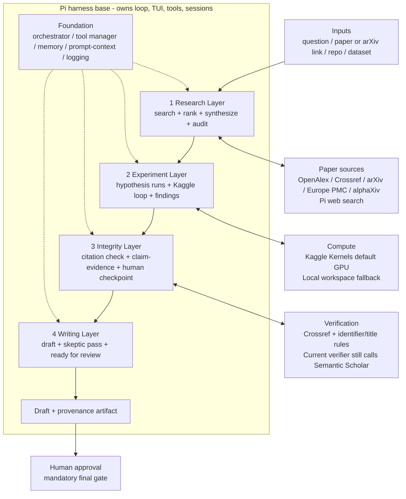
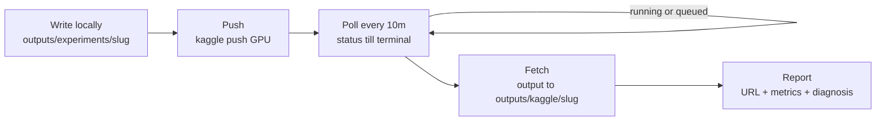

# ResearchX — Literature and Architecture Review

Audit date: 5 September 2026. This document reviews the systems, sources and
architecture behind ResearchX and checks the written claims against the current
checked-out source tree.

> Base claim of this document: **base harness = Pi agent harness**.
> The review distinguishes the target architecture from capabilities actually
> evidenced in the current checkout.

## 1. Introduction

ResearchX is being developed as a terminal (TUI) research agent with a
verifiable-output contract: a question should produce source-backed evidence,
experiment artifacts and a draft that is not final until a human approves it.
The discussed architecture has four layers over a foundation:

1. **Research** — search, rank, synthesize and audit code against paper claims.
2. **Experiment** — isolate hypotheses, run code, preserve findings and stop
   repeated failures.
3. **Integrity** — verify citation metadata, trace claims to evidence and gate
   finalization.
4. **Writing** — draft from verified findings, run a skeptic pass and prepare
   the human-review artifact.

Foundation: agent orchestrator, tool manager, memory, prompt/context
management, logging and monitoring.

Data flow: Inputs → Research → Experiment → Integrity → Writing → Human
Approval, with sources/compute/verification attached per layer.

The current checkout supports the Pi-native runtime boundary, PaperRank,
science-database search, Kaggle tools, skeptic workflow and persisted human
checkpoint. It does not yet prove a complete hypothesis-branch ledger or
doom-loop detector, and its citation verifier still calls Semantic Scholar.
This review treats those as implementation gaps rather than silently calling
them complete.

## 2. Base: Pi Agent Harness

ResearchX runs on the **Pi agent harness** (`pi-agent-core`, `pi-ai`,
`pi-coding-agent`, `pi-tui`). Pi owns the interactive loop and native TUI,
model/provider routing, tool and extension registration, sessions and bundled
research subagents.

ResearchX adds domain capabilities as **Pi extensions, tools, prompts, and
skills**; it does not create a second interaction loop. The checked-out package
manifest pins the Pi packages at `0.84.2`, exposes ResearchX extensions,
prompts and skills, and launches the Pi CLI child. That is evidence for the
base-runtime claim; it is not evidence that every four-layer contract is
complete.

## 3. Related Systems — patterns, not runtimes

| System | Useful pattern we adopt | What we deliberately do not take |
|---|---|---|---|
| Research-first agent patterns | Paper search + ranking, literature synthesis with source-per-claim tagging, code-vs-paper audit, typed research-run contract (papers, entities, tools, artifacts, verification states `not_checked/inferred/partial/verified/blocked/failed`), citation-integrity check, human checkpoint, skeptic/reviewer pass, provenance sidecars | External runtime coupling; Pi is the base |
| ResearchX execution controls | Kaggle push/status/output, Pi session branching and persistent checkpoints | The findings-ledger and doom-loop portions remain partial at this audit |
| academic-research-skills methodology | Explicit per-stage confirmations, integrity gates between stages, single-pass skeptic review before delivery | Independent contracts; no workflow text is copied |
| DeepScientist local-first studio | Quest-shaped state, branches, durable findings, preserved failures and human takeover | Its daemon/runner control plane as base; we map the ideas onto `outputs/` and provenance |

Concretely, ResearchX keeps: `lit` (plan → gather → synthesize → cite →
verify → deliver with `.provenance.md`), `audit` (claims vs code with
evidence links), `draft` + `skeptic` (verified-findings-only drafting),
`replicate`/`recipe` (bounded reproduction), and the `final_approval` persisted
checkpoint (`/finalize` fails until `/approve-final` records a human). The
experiment ledger and doom-loop guard are still implementation work.

## 4. Sources and verification boundary

The intended discovery baseline is OpenAlex, Crossref, arXiv and Europe
PMC/PubMed, with alphaXiv and Pi web search as additional retrieval surfaces.
Their roles are different:

| Function | Source or path | What it supports | Limitation |
|---|---|---|---|
| Ranking and graph | OpenAlex Works API | Works, citations, topics, open access, references and filters | Metadata is not claim truth |
| DOI metadata | Crossref REST API | DOI records, deposited metadata and query endpoints | A DOI record does not prove a scientific conclusion |
| Preprints | arXiv API | Public e-print metadata and identifiers | API terms and acknowledgement guidance apply |
| Biomedical search/full text | Europe PMC + PubMed | Search, citation links, cross-references and OA full-text routes | Europe PMC full text is the Open Access subset |
| Discovery | alphaXiv + Pi web search | Additional paper and web retrieval | Results still need source and claim checks |
| Citation verdicts | Current Crossref + Semantic Scholar tool | Deterministic existence/title/year checks | Current implementation is not Scholar-independent |

The checked-out `citation-integrity` tool calls Crossref and Semantic Scholar.
OpenAlex and arXiv are available in the science-database layer, but OpenAlex is
not the provider used by that verifier. The report can therefore claim an
OpenAlex-centred discovery baseline, but not Scholar-independent citation
verification until that code path is removed or intentionally accepted.

The current title verifier uses the stricter of Jaccard word overlap and a
character-level Levenshtein ratio. For title references, `similarity >= 0.85`
and year agreement within one year are required. For DOI and arXiv identifiers,
successful resolution plus year agreement is the deciding condition; title
similarity is returned for inspection but is not the gate.

## 5. Experiment autonomy — intended contract and current status

Kaggle Kernels are the default remote experiment backend and the local
workspace is the fallback. The intended loop is:

1. Write code locally under `outputs/experiments/<slug>/` and run a fast smoke
   check only.
2. Push with `researchx_kaggle_push`, normally with GPU enabled, and record the
   kernel slug and URL.
3. Poll `researchx_kaggle_status` every ten minutes until a terminal state.
4. Fetch completed outputs with `researchx_kaggle_output` into
   `outputs/kaggle/<slug>/`.
5. Report the URL, state, metrics, artifacts and failure diagnosis.

`researchx_kaggle_experiment` bundles push, polling and output collection. The
product policy is Kaggle-first plus local fallback, although other provider
paths still exist in the workbench source and are outside this default path.

The stronger contract — one hypothesis branch, an append-only findings ledger,
and a doom-loop detector — remains planned/partial in the current checkout.
The report must not present those guards as completed until dedicated state,
stopping rules and regression tests exist.

## 6. Architecture (Mermaid)

The four-layer diagram is redrawn in `architecture.mmd` and Figure 1.1 of the
PDF. Solid arrows are the evidence flow. Double-headed links attach source,
compute and verification services to the relevant layer. The dashed boundary
contains the Pi-owned layers, output artifact and foundation; human approval is
outside that runtime boundary.

Kaggle autonomous sub-loop:

## 7. Integrity and Human Oversight

Every decisive citation should be checked for identifier/metadata agreement;
every empirical claim should point to a logged run or be marked as planned; and
the `final_approval` checkpoint must be persisted rather than inferred from
agent prose. The skeptic workflow is useful only when its claim inventory,
evidence paths and blocking issues are saved beside the artifact.

The current human-checkpoint tool persists `outputs/checkpoints.json` and
requires the human’s explicit decision for approval. That is a real gate. It
does not compensate for missing experiment-ledger state or an unresolved
verification-provider policy.

## 8. Gaps and Next Work

- Remove or deliberately document the Semantic Scholar call in the citation
  verifier before claiming Scholar-independent verification.
- Implement the hypothesis-specific findings ledger with run IDs, branch/slug,
  environment fingerprint, metrics, failure reason and stopping decision.
- Add a tested doom-loop detector with explicit retry, timeout and budget rules.
- Decide whether remaining workbench provider paths are supported or must be
  removed from the product surface.
- Evaluate the broad science-database registry against the OpenAlex/Crossref
  baseline instead of treating connector count as quality.
- Preserve arXiv and other provider terms/acknowledgements in user-facing docs.

## References

- Pi agent harness: <https://github.com/earendil-works/pi>
- Academic Research Skills: <https://github.com/imbad0202/academic-research-skills>
- DeepScientist: <https://github.com/ResearAI/DeepScientist>
- Elicit: <https://elicit.com>
- Jenni AI: <https://jenni.ai>
- Clusy: <https://www.clusy.io>
- Scite: <https://scite.ai>
- OpenAlex Works documentation: <https://help.openalex.org/data/works/>
- Crossref REST API: <https://www.crossref.org/documentation/retrieve-metadata/rest-api/>
- arXiv API access: <https://info.arxiv.org/help/api/index.html>
- Europe PMC RESTful Web Service: <https://europepmc.org/RestfulWebService>
- alphaXiv: <https://alphaxiv.org>
- Kaggle CLI: <https://github.com/Kaggle/kaggle-cli>
- Semantic Scholar API: <https://www.semanticscholar.org/product/api>
